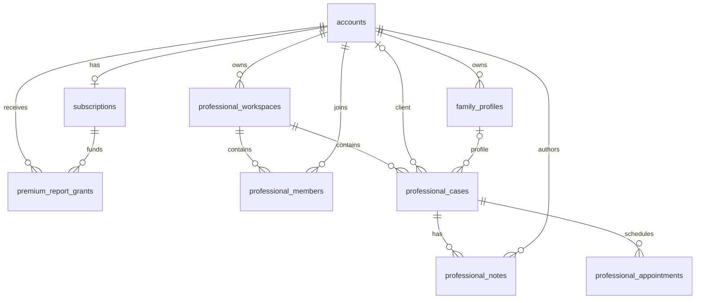

# Celestial ASTRO AI — API and Database Inventory

- Status: Source of truth
- Jira: `KAN-16 / ASTRO-103`
- Repository: `Govi2435/Celestial-ASTRO-AI`
- Scope: Current P0–P8 API surface, persistence code, SQL migrations, and P9 activation gaps
- Verified against: `main` after ASTRO-102

This document inventories the interfaces and data structures that exist in the repository today. It does not describe proposed routes or tables as if they were already implemented.

## 1. Inventory summary

### Current API surface

- Route files: **5**
- HTTP operations: **7**
- Public operations: **7**
- Authenticated operations: **0**
- Operations that persist application data: **0**
- Operations that currently require D1: **0**
- Operations that call an external service: **1**
- Binary-response operations: **1**

### Current database surface

- SQL migrations: **3**
- Tables across migrations: **11**
- Tables represented in typed `db/schema.ts`: **3**
- Tables present only in raw SQL migrations: **8**
- Configured production D1 binding: **No**
- Configured R2 binding: **No**
- Public CRUD APIs for P6–P8 records: **None**

## 2. Global API characteristics

| Characteristic | Current state |
| --- | --- |
| Runtime | Vinext / Next.js route handlers on a Cloudflare-compatible runtime |
| API version prefix | None; current paths use `/api/...` rather than `/api/v1/...` |
| Authentication middleware | Not implemented |
| Session verification | Not implemented |
| CSRF protection | Not implemented |
| Standard response envelope | Not implemented; each route returns its own direct JSON or PDF response |
| Runtime schema library | Not implemented; validation is currently handwritten in domain functions and route handlers |
| Correlation/request IDs | Not implemented |
| Central rate limiting | Not implemented |
| Central error mapping | Not implemented |
| OpenAPI specification | Not implemented |
| Application persistence | Not active in public routes |
| Calculation trust rule | Routes recalculate from submitted birth inputs and do not trust client-supplied chart positions |

## 3. Endpoint matrix

| Method | Path | Purpose | Success response | Success cache | Auth | Persistence | External dependency |
| --- | --- | --- | --- | --- | --- | --- | --- |
| `GET` | `/api/places?q=` | Search birthplace candidates and derive IANA timezone | JSON place list | Public 24-hour cache with stale revalidation | None | None | OpenStreetMap Nominatim |
| `POST` | `/api/calculate` | Calculate timed, approximate, or unknown-time chart | JSON calculation result | `no-store` | None | None | None |
| `GET` | `/api/ask-my-chart` | Return active deterministic question profile | JSON profile | `no-store` | None | None | None |
| `POST` | `/api/ask-my-chart` | Recalculate chart and answer a supported chart question | JSON grounded answer | `no-store` | None | None | None |
| `GET` | `/api/premium-report` | Return premium-report profile and policies | JSON profile | No explicit cache header | None | None | None |
| `POST` | `/api/premium-report` | Recalculate and generate an A4 PDF report | PDF attachment | `no-store, private` | None | None | None |
| `GET` | `/api/certification` | Return calculation engine, method, evidence, and certificate metadata | JSON certificate payload | Public 24-hour cache | None | None | None |

## 4. Detailed API contracts

---

## 4.1 `GET /api/places?q=`

**Source:** `app/api/places/route.ts`

### Purpose

Searches OpenStreetMap Nominatim for up to five birthplace candidates and derives an IANA timezone from each candidate's coordinates.

### Request

| Location | Name | Type | Required | Validation |
| --- | --- | --- | --- | --- |
| Query | `q` | string | Yes | Trimmed length must be between 3 and 120 characters |
| Header | `Accept-Language` | string | No | Forwarded to Nominatim; defaults to `en` |

### External request

```text
GET https://nominatim.openstreetmap.org/search
  ?q=<query>
  &format=jsonv2
  &addressdetails=1
  &limit=5
```

The application sends:

- `Accept: application/json`
- the caller's `Accept-Language` when present
- `User-Agent: Celestial-ASTRO-AI/0.2`

### Success response — `200`

```json
{
  "results": [
    {
      "id": "123",
      "displayName": "Ahmedabad, Gujarat, India",
      "latitude": 23.0225,
      "longitude": 72.5714,
      "timezoneId": "Asia/Kolkata",
      "type": "city",
      "provider": "OpenStreetMap Nominatim"
    }
  ]
}
```

### Success headers

```text
Cache-Control: public, max-age=86400, stale-while-revalidate=604800
X-Place-Provider: OpenStreetMap Nominatim
```

### Error responses

| Status | Condition | Body |
| --- | --- | --- |
| `400` | Query shorter than 3 or longer than 120 characters | `{ "error": "Enter at least three characters for the birthplace." }` |
| `502` | Nominatim failure, non-success status, network failure, or mapping error | `{ "error": "Place search is temporarily unavailable. Use the verified manual location fields." }` |

### Current risks and gaps

- No request rate limiting.
- No server-side response-shape validation for Nominatim data.
- Failed numeric conversion is not explicitly rejected before timezone lookup.
- Public caching may expose only the search term and place results, not user birth data.
- The application depends on Nominatim availability and acceptable-use requirements.

---

## 4.2 `POST /api/calculate`

**Sources:**

- `app/api/calculate/route.ts`
- `app/calculation.ts`
- `app/astro.ts`
- `app/timezone.ts`

### Purpose

Calculates a server-side chart using exact, approximate, or unknown birth-time semantics and returns a reproducibility receipt.

### Request body

```ts
type CalculationRequest = {
  name: string;
  location: string;
  date: string;
  time: string;
  timeConfidence: "exact" | "approximate" | "unknown";
  uncertaintyMinutes: number;
  timezoneId: string;
  latitude: number;
  longitude: number;
  placeProvider: string;
};
```

### Validation currently enforced

| Field | Rule |
| --- | --- |
| `date` | Must match `YYYY-MM-DD` |
| `location` | Trimmed value must not be empty |
| `timezoneId` | Trimmed value must not be empty and must resolve through timezone processing |
| `latitude` | Finite number from `-90` through `90` |
| `longitude` | Finite number from `-180` through `180` |
| `time` | Required when `timeConfidence` is not `unknown` |
| `uncertaintyMinutes` | For approximate time, must be one of `5`, `10`, `15`, `30`, or `60` |

### Important validation gaps

- The route casts parsed JSON to `CalculationRequest`; no schema library proves every property exists with the correct runtime type.
- No explicit maximum lengths are enforced here for `name`, `location`, `timezoneId`, or `placeProvider`.
- No request-body size limit is set at route level.
- No account, ownership, usage, or rate-limit checks exist.

### Success response — timed result

```ts
type TimedCalculationResult = {
  kind: "timed";
  chart: ChartResult;
  stability: StabilityCheck | null;
  receipt: CalculationReceipt;
};
```

`ChartResult` contains:

- submitted calculation input normalized into the legacy chart engine input;
- UTC calculation date;
- ayanamsa;
- Ascendant tropical and sidereal positions;
- Ascendant sign and degree;
- planetary positions;
- Moon Nakshatra and Pada;
- Tithi and Paksha;
- Yoga;
- Vimshottari Mahadasha segments;
- transparent rule checks; and
- numerology.

Each timed planet contains:

```ts
type PlanetPosition = {
  name: string;
  short: string;
  glyph: string;
  tropicalLongitude: number;
  longitude: number;
  signIndex: number;
  sign: string;
  degreeInSign: number;
  house: number;
  retrograde: boolean;
};
```

Approximate-time results may include:

```ts
type StabilityCheck = {
  uncertaintyMinutes: number;
  ascendantStable: boolean;
  moonSignStable: boolean;
  nakshatraStable: boolean;
  houseChanges: string[];
};
```

### Success response — unknown-time result

```ts
type UnknownCalculationResult = {
  kind: "unknown";
  input: CalculationRequest;
  utcRange: { start: string; end: string };
  planets: UnknownPlanetRange[];
  possibleNakshatras: string[];
  possibleTithis: string[];
  possibleYogas: string[];
  numerology: ChartResult["numerology"];
  suppressed: string[];
  receipt: CalculationReceipt;
};
```

Each unknown-time planetary range contains:

```ts
type UnknownPlanetRange = {
  name: string;
  glyph: string;
  start: string;
  end: string;
  possibleSigns: string[];
  stableSign: boolean;
};
```

### Calculation receipt

The response includes `calculation-receipt-v3` with:

- deterministic chart ID;
- SHA-256 input fingerprint;
- calculation timestamp;
- birth-time confidence;
- local input;
- normalized UTC instant or date range;
- coordinates;
- IANA timezone;
- historical offset and abbreviation;
- timezone-data version;
- place provider;
- calculation profile;
- zodiac, ayanamsa, house, and node profiles;
- engine and kernel information;
- validation profile; and
- P2 internal certificate metadata.

### Success headers

```text
Cache-Control: no-store
X-Celestial-Engine: celestial-mit-v1
```

### Error response — `422`

```json
{
  "error": "Validation or calculation error message"
}
```

The route returns `422` for JSON parsing errors, validation failures, timezone failures, and calculation failures.

### Persistence and data handling

- No calculation is stored by this endpoint.
- No D1 access occurs.
- The response may contain sensitive birth details and therefore uses `no-store`.

---

## 4.3 `GET /api/ask-my-chart`

**Sources:**

- `app/api/ask-my-chart/route.ts`
- `app/ask-my-chart.ts`

### Purpose

Returns the active deterministic Ask My Chart profile.

### Success response — `200`

The response includes:

```ts
{
  id: "celestial-ask-my-chart-p4-v2";
  schema: "ask-my-chart-answer-v1";
  status: "Active";
  responseEngine: "deterministic-evidence-router";
  generativeModel: "none";
  supportedIntents: string[];
  guardrails: string[];
}
```

### Success headers

```text
Cache-Control: no-store
X-Celestial-Ask-Profile: celestial-ask-my-chart-p4-v2
```

### Current notes

- The route does not call a model provider.
- No account, session, or storage is used.
- The profile is currently no-store even though it contains no personal data.

---

## 4.4 `POST /api/ask-my-chart`

**Sources:**

- `app/api/ask-my-chart/route.ts`
- `app/ask-my-chart.ts`
- `app/calculation.ts`
- `app/interpretation.ts`

### Purpose

Recalculates a chart from submitted birth inputs, creates the approved P4 interpretation report, detects question intent, and returns a deterministic evidence-linked answer.

### Request body

```ts
type AskMyChartRequest = {
  question?: unknown;
  calculation?: CalculationRequest;
};
```

Example:

```json
{
  "question": "What themes shape career decisions?",
  "calculation": {
    "name": "Example",
    "location": "Ahmedabad, Gujarat, India",
    "date": "2000-08-14",
    "time": "10:30",
    "timeConfidence": "approximate",
    "uncertaintyMinutes": 15,
    "timezoneId": "Asia/Kolkata",
    "latitude": 23.0225,
    "longitude": 72.5714,
    "placeProvider": "OpenStreetMap Nominatim"
  }
}
```

### Route-level validation

| Field | Rule |
| --- | --- |
| `question` | Must be a non-empty string after trimming |
| `question` | Maximum 400 characters |
| `calculation` | Must be present |
| calculation fields | Revalidated through `calculateCelestial()` |

### Success response — `200`

```ts
type AskMyChartAnswer = {
  schema: "ask-my-chart-answer-v1";
  profileId: "celestial-ask-my-chart-p4-v2";
  answerId: string;
  chartId: string;
  question: string;
  intent: AskMyChartIntent;
  status: "answered" | "limited" | "not-supported" | "refused";
  title: string;
  answer: string;
  disclosure: string;
  generatedBy: "deterministic-evidence-router";
  evidence: InterpretationInsight[];
  grounding: {
    ruleIds: string[];
    sourcePaths: string[];
    evidenceCount: number;
  };
  limitations: string[];
  suggestedQuestions: string[];
};
```

### Intent values

```text
overview
identity
emotions
communication
drive
current-cycle
career-decisions
relationship
compatibility
prediction
high-stakes
override-attempt
unknown
```

### Guardrail behavior

| Intent | Current behavior |
| --- | --- |
| Supported reflective intent | Answers from approved evidence and limitations |
| Missing time-dependent evidence | Returns `limited` without inventing factors |
| Compatibility request | Returns `not-supported` |
| Guaranteed prediction | Returns `refused` |
| Medical, legal, financial, or mental-health conclusion | Returns `refused` |
| Evidence/guardrail override attempt | Returns `refused` |

### Success headers

```text
Cache-Control: no-store
X-Celestial-Ask-Profile: celestial-ask-my-chart-p4-v2
X-Celestial-Chart: <chart ID>
```

### Error response — `422`

```json
{
  "error": "Validation or calculation error message"
}
```

### Persistence and data handling

- The route does not store questions, birth data, answers, threads, or messages.
- No model memory exists.
- No D1 access occurs.
- Browser-supplied planetary positions or interpretations are not accepted.

---

## 4.5 `GET /api/premium-report`

**Sources:**

- `app/api/premium-report/route.ts`
- `app/premium-report.ts`

### Purpose

Returns the report profile together with two route-level policies:

- calculation is repeated from submitted birth details before rendering;
- only approved P4 evidence-linked interpretations are included.

### Success response — `200`

```json
{
  "...premiumReportProfile": "Fields from PREMIUM_REPORT_PROFILE",
  "calculationPolicy": "The report endpoint recalculates from submitted birth details before rendering.",
  "interpretationPolicy": "Only approved P4 evidence-linked rules are included."
}
```

### Current notes

- No explicit `Cache-Control` header is set in this handler.
- No authentication is required.
- No user-specific data is returned.

---

## 4.6 `POST /api/premium-report`

**Sources:**

- `app/api/premium-report/route.ts`
- `app/premium-report.ts`
- `app/calculation.ts`
- `app/interpretation.ts`

### Purpose

Recalculates a chart, rebuilds approved interpretations, and renders a private A4 PDF report using `pdf-lib`.

### Request body

```ts
{
  calculation?: CalculationRequest;
}
```

### Current processing order

```text
Parse JSON
→ require calculation object
→ calculateCelestial(calculation)
→ buildInterpretationReport(result)
→ buildPremiumReport(result, interpretation)
→ return PDF
```

### Missing protection order

The current route does **not** perform:

- authentication;
- session verification;
- account lookup;
- chart ownership verification;
- P7 subscription lookup;
- premium-report grant lookup;
- `assertPremiumReportEntitlement()` call;
- rate or usage limiting;
- idempotency handling; or
- report-record persistence.

### Success response — `200`

Binary PDF bytes with a filename derived from the calculated profile name.

### Success headers

```text
Content-Type: application/pdf
Content-Disposition: attachment; filename="<safe-name>-celestial-report.pdf"
Cache-Control: no-store, private
X-Content-Type-Options: nosniff
X-Celestial-Report: <premium report profile ID>
X-Celestial-Receipt: <chart ID>
```

Filename normalization:

- lowercases the name;
- replaces non-alphanumeric runs with `-`;
- trims leading and trailing hyphens;
- limits the safe name to 48 characters;
- falls back to `private-chart-celestial-report.pdf`.

### Error response — `422`

```json
{
  "error": "Validation, calculation, interpretation, or PDF-generation error message"
}
```

### Persistence and data handling

- The report is returned directly and not placed in a report library.
- R2 is not configured.
- No report record, entitlement-use record, or audit event is written.

---

## 4.7 `GET /api/certification`

**Sources:**

- `app/api/certification/route.ts`
- `app/certification-profile.ts`
- `app/engine-profile.ts`

### Purpose

Returns machine-readable calculation method and internal P2 reproducibility certification metadata.

### Success response — `200`

```ts
{
  certificate: CertificationProfile;
  engine: EngineProfile;
  methods: {
    ayanamsa: AyanamsaProfile;
    houses: HouseProfile;
    nodes: NodeProfile;
  };
  evidence: {
    external: string;
    regression: string;
    timezone: string;
  };
  limitations: string[];
}
```

The limitations state that:

- the certificate is internal rather than third-party accreditation;
- it does not validate astrological interpretations or guaranteed outcomes; and
- NASA/JPL comparisons cover only pinned planetary positions.

### Success headers

```text
Cache-Control: public, max-age=86400
X-Celestial-Certificate: <certificate ID>
```

### Persistence and security

- Public metadata only.
- No request body.
- No D1 access.

## 5. API error and security inventory

| Control | Current state | P9 requirement |
| --- | --- | --- |
| Authentication | None on all routes | Add verified session middleware for account-owned routes |
| Authorization | None | Scope every profile, report, subscription, and workspace query by authenticated principal |
| CSRF | None | Protect cookie-authenticated state-changing requests |
| Rate limiting | None | Add endpoint-specific limits, especially places, calculation, Ask My Chart, PDF, auth, and webhooks |
| Runtime validation | Handwritten and partial | Introduce shared runtime schemas and maximum lengths |
| Request-size limits | Not explicit | Add route-specific byte limits |
| Error envelope | Direct `{ error }` | Introduce stable error codes and request IDs |
| Sensitive logs | No central contract documented in routes | Add structured logging that excludes birth data and report content |
| Idempotency | None | Required for payments, reports, exports, deletion, and asynchronous jobs |
| Security headers | `nosniff` only on PDF response | Add centralized response-security policy |
| API versioning | None | Introduce `/api/v1` for new production CRUD surfaces or document compatibility policy |
| OpenAPI | None | Generate or maintain an API contract after production routes stabilize |

## 6. Database configuration

### Drizzle configuration

`drizzle.config.ts` uses:

```ts
{
  out: "./drizzle",
  schema: "./db/schema.ts",
  dialect: "sqlite"
}
```

### Runtime adapter

`db/index.ts`:

- imports `env` from `cloudflare:workers`;
- expects a binding named `DB`;
- initializes Drizzle with the typed schema; and
- throws when `env.DB` is unavailable.

### Hosting configuration

Current `.openai/hosting.json` state:

```json
{
  "d1": null,
  "r2": null
}
```

Therefore, the repository has database code and migrations but no configured deployment binding in the recorded hosting configuration.

## 7. Migration inventory

| Migration | Phase | Tables added | Typed schema parity |
| --- | --- | --- | --- |
| `drizzle/0000_p6_account_vault.sql` | P6 | `accounts`, `family_profiles`, `account_audit_events` | Yes, with noted FK limitation |
| `drizzle/0001_p7_billing.sql` | P7 | `subscriptions`, `billing_events`, `premium_report_grants` | No |
| `drizzle/0002_p8_professional_dashboard.sql` | P8 | `professional_workspaces`, `professional_members`, `professional_cases`, `professional_notes`, `professional_appointments` | No |

`PRAGMA foreign_keys=ON` appears in the first migration. Foreign-key enforcement must also be verified in every target environment and migration process.

## 8. Entity relationship overview



Not every logical relationship in the diagram has a declared SQL foreign key. The detailed table sections below identify those gaps.

## 9. Table inventory

---

## 9.1 `accounts`

**Defined in:**

- `db/schema.ts`
- `drizzle/0000_p6_account_vault.sql`

### Columns

| Column | Type | Null | Default | Meaning |
| --- | --- | --- | --- | --- |
| `id` | text | No | — | Primary account identifier |
| `email` | text | No | — | Account email |
| `display_name` | text | No | `''` | Display name |
| `status` | text | No | `active` | Typed enum in Drizzle: `active`, `deletion_pending`, `deleted` |
| `created_at` | text | No | — | Creation timestamp |
| `updated_at` | text | No | — | Last-update timestamp |
| `deletion_requested_at` | text | Yes | — | Deletion request timestamp |
| `deleted_at` | text | Yes | — | Deletion completion/mark timestamp |

### Keys and indexes

- Primary key: `id`
- Unique index: `accounts_email_unique(email)`

### Current gaps

- No auth provider identity table.
- No email verification state.
- No locale, avatar, timezone preference, or last-login fields.
- No database check constraint for allowed `status` values in raw SQL.
- Email normalization and case-sensitivity behavior are not defined at database level.

---

## 9.2 `family_profiles`

**Defined in:**

- `db/schema.ts`
- `drizzle/0000_p6_account_vault.sql`

### Columns

| Column | Type | Null | Default | Meaning |
| --- | --- | --- | --- | --- |
| `id` | text | No | — | Profile identifier |
| `account_id` | text | No | — | Owning account |
| `display_name` | text | No | — | Profile display name |
| `relationship` | text | No | — | Relationship to account owner |
| `birth_date` | text | No | — | Local birth date |
| `birth_time` | text | No | `''` | Local birth time; empty for unknown time |
| `time_confidence` | text | No | — | Exact, approximate, or unknown |
| `uncertainty_minutes` | integer | No | `0` | Approximate-time uncertainty |
| `location` | text | No | — | Birthplace label |
| `timezone_id` | text | No | — | IANA timezone |
| `latitude_e6` | integer | No | — | Latitude multiplied by 1,000,000 |
| `longitude_e6` | integer | No | — | Longitude multiplied by 1,000,000 |
| `place_provider` | text | No | — | Place-data source |
| `consent_confirmed_at` | text | No | — | Consent confirmation timestamp |
| `created_at` | text | No | — | Creation timestamp |
| `updated_at` | text | No | — | Last-update timestamp |

### Keys and indexes

- Primary key: `id`
- Foreign key: `account_id → accounts.id`
- Delete action: cascade
- Index: `family_profiles_account_idx(account_id)`

### Current gaps

- Consent is stored as one timestamp rather than a versioned consent record.
- No soft-delete column.
- No `is_primary` field.
- No unique rule preventing duplicate self profiles.
- No database constraints enforce latitude, longitude, uncertainty, or time-confidence consistency.
- Relationship and time-confidence values are domain-validated but not constrained in raw SQL.

---

## 9.3 `account_audit_events`

**Defined in:**

- `db/schema.ts`
- `drizzle/0000_p6_account_vault.sql`

### Columns

| Column | Type | Null | Default |
| --- | --- | --- | --- |
| `id` | text | No | — |
| `account_id` | text | No | — |
| `event_type` | text | No | — |
| `occurred_at` | text | No | — |
| `metadata_json` | text | No | `{}` |

### Keys and indexes

- Primary key: `id`
- Index: `account_audit_account_idx(account_id)`

### Important integrity gap

`account_id` is indexed but has **no declared foreign key** to `accounts.id` in either the typed schema or migration.

This may be intentional if audit events must survive account deletion, but that retention decision is not encoded or documented in the table. P9 must explicitly decide between:

1. foreign key with cascade;
2. foreign key with set-null and nullable account reference;
3. deliberate non-FK immutable audit reference; or
4. pseudonymized actor/reference design.

Raw birth data, chat content, report content, and secrets must not be placed in `metadata_json`.

---

## 9.4 `subscriptions`

**Defined in:** `drizzle/0001_p7_billing.sql` only

### Columns

| Column | Type | Null | Default |
| --- | --- | --- | --- |
| `id` | text | No | — |
| `account_id` | text | No | — |
| `provider` | text | No | — |
| `provider_customer_id` | text | Yes | — |
| `provider_subscription_id` | text | Yes | — |
| `plan_id` | text | No | — |
| `status` | text | No | — |
| `current_period_end` | text | Yes | — |
| `cancel_at_period_end` | integer | No | `0` |
| `created_at` | text | No | — |
| `updated_at` | text | No | — |

### Keys and indexes

- Primary key: `id`
- Foreign key: `account_id → accounts.id`, cascade delete
- Unique index: `subscriptions_account_unique(account_id)`
- Unique index: `subscriptions_provider_subscription_unique(provider_subscription_id)`

### Current implications and gaps

- The unique account index permits only one subscription row per account, preventing subscription history or concurrent product subscriptions.
- `provider_customer_id` is not indexed or unique.
- Provider and provider-subscription uniqueness are not combined; this may matter if multiple providers are added.
- Plan and status values have no database constraints.
- Trial start, current period start, cancellation timestamp, and provider metadata are absent.
- This table is missing from `db/schema.ts`.

---

## 9.5 `billing_events`

**Defined in:** `drizzle/0001_p7_billing.sql` only

### Columns

| Column | Type | Null | Meaning |
| --- | --- | --- | --- |
| `id` | text | No | Internal event ID |
| `provider` | text | No | Payment provider |
| `provider_event_id` | text | No | Provider event ID |
| `account_id` | text | Yes | Optional resolved account reference |
| `event_type` | text | No | Internal or translated event type |
| `received_at` | text | No | Receipt timestamp |
| `processed_at` | text | Yes | Processing timestamp |
| `payload_sha256` | text | No | Payload fingerprint |
| `processing_error` | text | Yes | Processing failure summary |

### Keys and indexes

- Primary key: `id`
- Unique index: `billing_events_provider_event_unique(provider, provider_event_id)`
- Index: `billing_events_account_idx(account_id)`

### Important integrity and security notes

- `account_id` has no declared foreign key.
- The full webhook payload is not stored by this table, only a hash and processing metadata.
- Idempotency is supported by provider plus provider-event uniqueness.
- Signature verification is not implemented by the current domain helper.
- This table is missing from `db/schema.ts`.

---

## 9.6 `premium_report_grants`

**Defined in:** `drizzle/0001_p7_billing.sql` only

### Columns

| Column | Type | Null |
| --- | --- | --- |
| `id` | text | No |
| `account_id` | text | No |
| `chart_id` | text | No |
| `subscription_id` | text | Yes |
| `granted_at` | text | No |
| `expires_at` | text | Yes |

### Keys and indexes

- Primary key: `id`
- Foreign key: `account_id → accounts.id`, cascade delete
- Foreign key: `subscription_id → subscriptions.id`, set null on delete
- Index: `premium_report_grants_account_idx(account_id)`

### Current gaps

- No uniqueness constraint prevents duplicate grants for the same account and chart.
- No consumed/revoked timestamp.
- No source type for one-time purchase versus subscription allowance.
- No report record or generated-object reference.
- The live PDF route does not query this table.
- This table is missing from `db/schema.ts`.

---

## 9.7 `professional_workspaces`

**Defined in:** `drizzle/0002_p8_professional_dashboard.sql` only

### Columns

| Column | Type | Null |
| --- | --- | --- |
| `id` | text | No |
| `name` | text | No |
| `owner_account_id` | text | No |
| `created_at` | text | No |
| `updated_at` | text | No |

### Keys and relationships

- Primary key: `id`
- Foreign key: `owner_account_id → accounts.id`, cascade delete

### Current gaps

- No workspace status.
- No professional verification state.
- No brand metadata.
- No index on owner account.
- No retention or archive state.
- Missing from `db/schema.ts`.

---

## 9.8 `professional_members`

**Defined in:** `drizzle/0002_p8_professional_dashboard.sql` only

### Columns

| Column | Type | Null |
| --- | --- | --- |
| `id` | text | No |
| `workspace_id` | text | No |
| `account_id` | text | No |
| `role` | text | No |
| `created_at` | text | No |

### Keys and indexes

- Primary key: `id`
- Foreign key: `workspace_id → professional_workspaces.id`, cascade delete
- Foreign key: `account_id → accounts.id`, cascade delete
- Unique index: `professional_members_workspace_account_unique(workspace_id, account_id)`

### Current gaps

- Role is not constrained at database level.
- No invitation, acceptance, suspension, or removal state.
- No `updated_at`.
- No direct index on `account_id` for listing a user's workspaces.
- Missing from `db/schema.ts`.

---

## 9.9 `professional_cases`

**Defined in:** `drizzle/0002_p8_professional_dashboard.sql` only

### Columns

| Column | Type | Null |
| --- | --- | --- |
| `id` | text | No |
| `workspace_id` | text | No |
| `client_account_id` | text | Yes |
| `assigned_professional_id` | text | No |
| `family_profile_id` | text | Yes |
| `chart_id` | text | Yes |
| `status` | text | No |
| `consent_granted_at` | text | Yes |
| `consent_revoked_at` | text | Yes |
| `created_at` | text | No |
| `updated_at` | text | No |

### Keys and indexes

- Primary key: `id`
- Foreign key: `workspace_id → professional_workspaces.id`, cascade delete
- Foreign key: `client_account_id → accounts.id`, set null on delete
- Foreign key: `family_profile_id → family_profiles.id`, set null on delete
- Index: `professional_cases_workspace_idx(workspace_id)`
- Index: `professional_cases_assignee_idx(assigned_professional_id)`

### Important integrity gap

`assigned_professional_id` is indexed but has **no declared foreign key**. The domain model treats it as a professional identifier, but the schema does not prove that it references:

- `professional_members.id`;
- `accounts.id`; or
- another professional identity table.

This relationship must be resolved before production authorization middleware is implemented.

### Additional gaps

- Consent is represented by timestamps rather than a versioned consent record.
- Status is not constrained in SQL.
- No archive timestamp.
- No title or client-reference field.
- `chart_id` references no persisted chart table.
- Missing from `db/schema.ts`.

---

## 9.10 `professional_notes`

**Defined in:** `drizzle/0002_p8_professional_dashboard.sql` only

### Columns

| Column | Type | Null |
| --- | --- | --- |
| `id` | text | No |
| `case_id` | text | No |
| `author_account_id` | text | No |
| `body` | text | No |
| `created_at` | text | No |
| `updated_at` | text | No |

### Keys and indexes

- Primary key: `id`
- Foreign key: `case_id → professional_cases.id`, cascade delete
- Foreign key: `author_account_id → accounts.id`, cascade delete
- Index: `professional_notes_case_idx(case_id)`

### Current gaps

- No visibility field.
- No soft deletion.
- No version history.
- No database body-length constraint; the domain helper enforces a 10,000-character maximum.
- Author references account rather than workspace membership, so workspace-role validity must be checked in application authorization.
- Missing from `db/schema.ts`.

---

## 9.11 `professional_appointments`

**Defined in:** `drizzle/0002_p8_professional_dashboard.sql` only

### Columns

| Column | Type | Null |
| --- | --- | --- |
| `id` | text | No |
| `case_id` | text | No |
| `status` | text | No |
| `starts_at` | text | No |
| `ends_at` | text | No |
| `timezone_id` | text | No |
| `created_at` | text | No |
| `updated_at` | text | No |

### Keys and indexes

- Primary key: `id`
- Foreign key: `case_id → professional_cases.id`, cascade delete
- Index: `professional_appointments_case_idx(case_id)`

### Current gaps

- No professional-member field.
- No meeting provider or meeting reference.
- No reminder or notification state.
- No database constraint requiring `ends_at` after `starts_at`.
- Status transitions are enforced only through domain code.
- Missing from `db/schema.ts`.

## 10. Typed schema parity matrix

| Table | Raw migration | Typed Drizzle | Current parity status |
| --- | --- | --- | --- |
| `accounts` | Yes | Yes | Substantially aligned |
| `family_profiles` | Yes | Yes | Substantially aligned |
| `account_audit_events` | Yes | Yes | Aligned, but no account FK |
| `subscriptions` | Yes | No | Missing from typed schema |
| `billing_events` | Yes | No | Missing from typed schema |
| `premium_report_grants` | Yes | No | Missing from typed schema |
| `professional_workspaces` | Yes | No | Missing from typed schema |
| `professional_members` | Yes | No | Missing from typed schema |
| `professional_cases` | Yes | No | Missing from typed schema |
| `professional_notes` | Yes | No | Missing from typed schema |
| `professional_appointments` | Yes | No | Missing from typed schema |

Because Drizzle Kit generates migrations from `db/schema.ts`, running `npm run db:generate` before parity is restored may produce output inconsistent with the already committed P7/P8 SQL migrations.

## 11. Tables not currently implemented

The following records appear in the launch master plan or target architecture but do **not** exist in the current database:

### Identity and sessions

- `auth_identities`
- `sessions`
- `verification_tokens`
- account-link records

### Privacy and lifecycle

- versioned `consent_records`
- `deletion_requests`
- `data_exports`
- profile-share records

### Calculation and interpretation history

- `calculation_runs`
- `chart_receipts`
- `chart_snapshots`
- `interpretation_runs`
- `interpretation_items`

### AI conversation data

- `chat_threads`
- `chat_messages`
- `agent_runs`

### Billing expansion

- database-backed `plans`
- `purchases`
- generalized `entitlement_grants`
- invoices/refunds records
- webhook-attempt records

### Reports and operations

- `reports`
- `report_deliveries`
- `idempotency_keys`
- `feature_usage`
- generalized `audit_events`
- notification records
- workflow/job records

This section is a gap inventory, not authorization to create every table immediately. P9 should add only the minimum identity, session, profile, consent, audit, export, and deletion records required for Gate 1.

## 12. API surfaces not currently implemented

No current route handlers exist for:

### Authentication and account

```text
/api/auth/*
/api/v1/account
/api/v1/sessions
/api/v1/data-export
/api/v1/delete-account
```

### Family Vault

```text
GET    /api/v1/profiles
POST   /api/v1/profiles
GET    /api/v1/profiles/:id
PATCH  /api/v1/profiles/:id
DELETE /api/v1/profiles/:id
POST   /api/v1/profiles/:id/calculate
```

### Billing

```text
/api/v1/plans
/api/v1/checkout
/api/v1/subscription
/api/v1/billing-events or provider webhook
/api/v1/invoices
/api/v1/cancel-subscription
```

### Protected report library

```text
POST   /api/v1/reports
GET    /api/v1/reports
GET    /api/v1/reports/:id
GET    /api/v1/reports/:id/download
DELETE /api/v1/reports/:id
```

### Professional workspace

```text
/api/v1/workspaces
/api/v1/workspaces/:id/members
/api/v1/professional-cases
/api/v1/professional-cases/:id/consent
/api/v1/professional-cases/:id/notes
/api/v1/appointments
/api/v1/report-deliveries
```

### Generative AI

```text
/api/v1/chat/threads
/api/v1/chat/threads/:id/messages
```

These paths are target examples from the master plan, not current APIs.

## 13. Data sensitivity inventory

| Data | Current location | Sensitivity | Required handling before persistence |
| --- | --- | --- | --- |
| Name | Calculation request, optional report | Personal | Length validation, no unnecessary logging |
| Birth date | Calculation request and planned profile | Sensitive personal context | Account scoping, export/delete controls |
| Birth time | Calculation request and planned profile | Sensitive personal context | Preserve unknown state; no invented value |
| Coordinates | Calculation request and planned profile | Precise location-related personal data | Access control and logging minimization |
| Relationship label | `family_profiles` foundation | Personal relationship data | Consent and owner scoping |
| Chart output | Response only today | Derived personal profile | Define retention before storing |
| PDF report | Response only today | Derived personal content | Private object storage and signed access |
| Professional notes | P8 migration foundation | Confidential professional record | Workspace authorization and retention policy |
| Billing identifiers | P7 migration foundation | Financial account metadata | Provider verification and restricted access |
| Audit metadata | P6 foundation | Security/operational | Exclude raw birth, report, prompt, and secret data |

## 14. P9 database decisions required before activation

1. Add P7 and P8 tables to `db/schema.ts` or replace the current migration strategy with a documented reconciled baseline.
2. Decide the long-term identity keys for accounts, external identities, sessions, workspace members, and assigned professionals.
3. Resolve missing foreign-key decisions for:
   - `account_audit_events.account_id`;
   - `billing_events.account_id`; and
   - `professional_cases.assigned_professional_id`.
4. Decide whether one account may have subscription history or multiple concurrent subscriptions.
5. Define versioned consent rather than relying only on timestamps embedded in profile or case records.
6. Define report records and storage references before activating R2.
7. Define deletion and legal-retention behavior for billing, audit, professional, and report records.
8. Add constraints or application invariants for enum values, date ordering, coordinate ranges, and unknown-time semantics.
9. Configure separate development, staging, and production D1 bindings.
10. Apply migrations in a clean staging database and verify backup restoration before production use.

## 15. P9 API decisions required before activation

1. Select and validate authentication/session integration with Vinext and Cloudflare.
2. Establish a shared runtime-validation system.
3. Introduce stable response and error contracts for new APIs.
4. Require account and workspace scope in every data query rather than loading records by ID alone.
5. Add CSRF protection for cookie-authenticated writes.
6. Add rate limits and request-size limits.
7. Add request IDs and sensitive-data-safe logging.
8. Protect premium report generation before enabling paid checkout.
9. Keep anonymous calculation available without persistence unless the user explicitly saves a profile.
10. Create integration tests for cross-account and cross-workspace isolation.

## 16. Recommended P9 implementation boundary

### Gate 1 minimum database additions

The controlled account beta needs, at minimum:

- existing `accounts` and `family_profiles` reconciled;
- external identity records;
- secure session records or a clearly documented stateless-session design;
- versioned terms/privacy acceptance;
- consent records or a documented minimum consent model;
- deletion-request state;
- data-export state;
- audit events with an explicit retention model.

### Gate 1 minimum APIs

- sign-in and callback routes;
- account read/update;
- session list/revoke;
- profile CRUD;
- profile calculation;
- data export request/status/download;
- account deletion request/confirm;
- privacy and consent operations.

Billing, protected reports, professional records, and generative AI should remain behind their later launch gates.

## 17. Inventory maintenance rule

Update this document whenever:

- a route or HTTP method is added, removed, renamed, or protected;
- request or response fields change;
- caching or security headers change;
- a route starts reading or writing persistent data;
- a table, column, index, or foreign key changes;
- a migration is added or replaced;
- D1 or R2 becomes configured;
- authentication, payment, professional, or AI providers become active; or
- data-retention and deletion behavior changes.

The README, `docs/ARCHITECTURE.md`, API contracts, migrations, Drizzle schema, tests, product UI, and pitch claims must remain consistent with this inventory.
