# Celestial ASTRO AI — Current Architecture

- Status: Source of truth
- Jira: `KAN-16 / ASTRO-102`
- Repository: `Govi2435/Celestial-ASTRO-AI`
- Scope: Current P0–P8 implementation and P9 integration boundary
- Last verified against: `main` after ASTRO-101

This document describes what the repository actually implements today. It separates active runtime paths from P6–P8 foundations and from future architecture that has not yet been activated.

## Architecture rules

1. Calculations are performed on the server from submitted birth details.
2. Browser-supplied planetary positions and interpretations are not trusted.
3. Exact, approximate, and unknown birth times follow different calculation paths.
4. Every result carries a versioned calculation receipt.
5. The current interpretation and Ask My Chart systems are deterministic.
6. P6–P8 domain models are not equivalent to complete public product activation.
7. D1, R2, authentication, billing providers, generative AI, and professional UI must not be shown as active until their launch gates are complete.
8. Swiss Ephemeris, Python services, Redis, PostgreSQL, RAG, WebSockets, and multi-agent orchestration are future options, not current production dependencies.

## Status legend

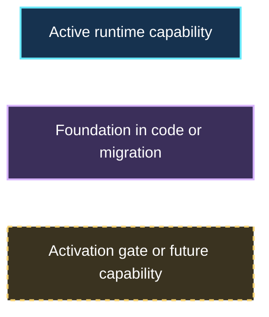

## 1. System context

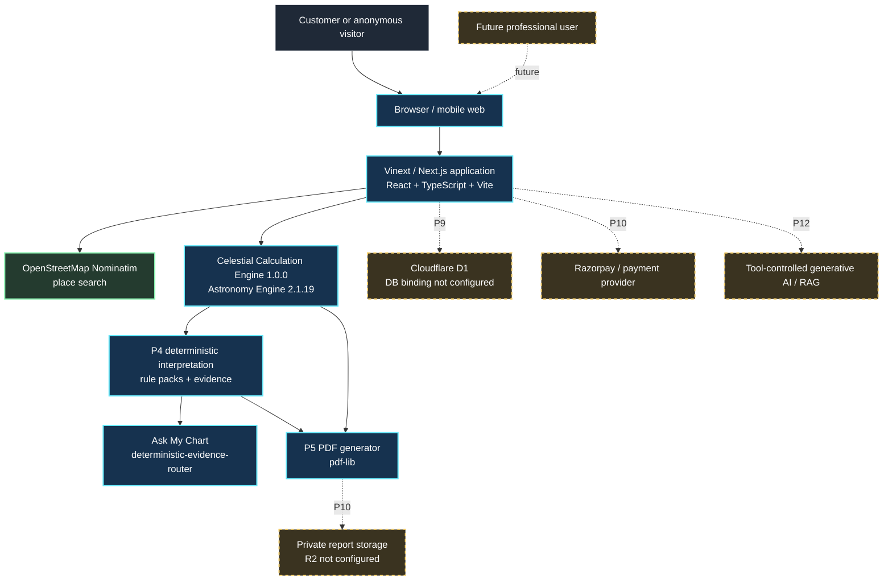

### Context interpretation

- The public web application, place lookup, calculation engine, interpretation rules, Ask My Chart router, and PDF generation are active.
- The D1 adapter and schemas exist, but the deployed hosting configuration currently has no D1 binding.
- R2 is not configured.
- No payment provider is connected.
- No generative model, RAG pipeline, or multi-agent runtime is active.
- The P8 professional workspace is a tested domain foundation, not a public dashboard.

## 2. Current application runtime

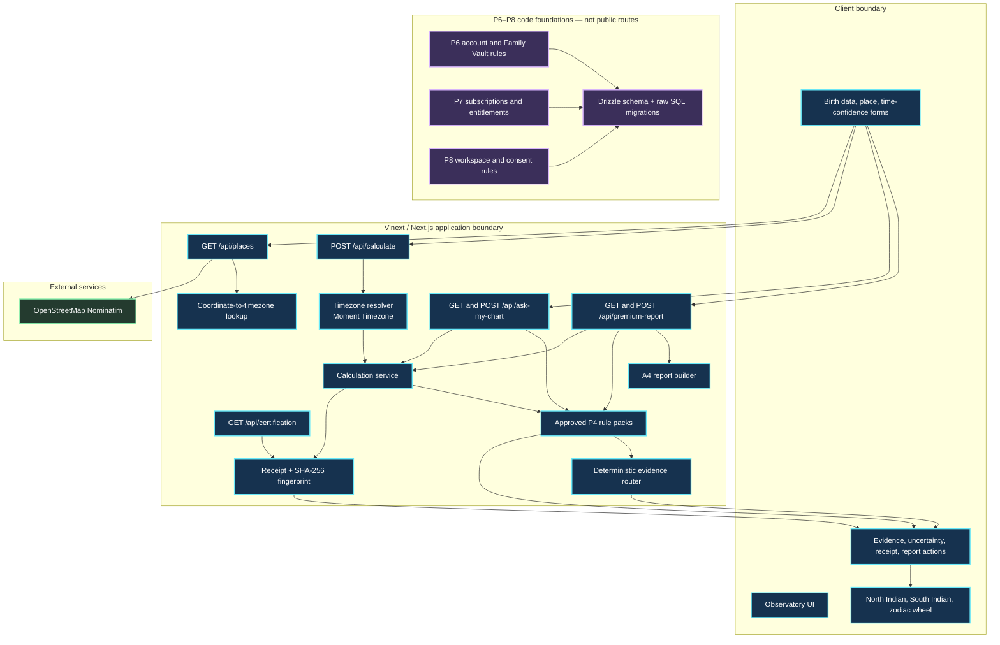

## 3. Chart calculation flow

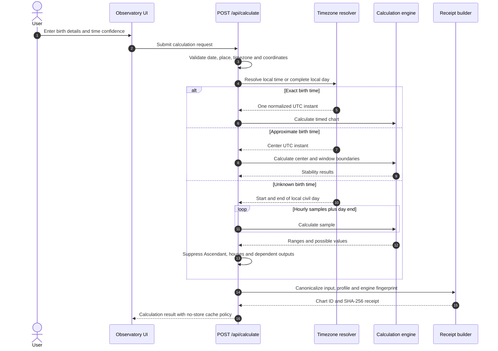

### Calculation boundary

The calculation engine receives verified birth inputs, not client-computed chart positions. The active profile is:

- sidereal zodiac;
- Mean Lahiri/Chitrapaksha J2000 linear model;
- whole-sign houses for timed charts;
- mean lunar nodes;
- Astronomy Engine `2.1.19`;
- Celestial Calculation Engine `1.0.0` wrapper.

## 4. Ask My Chart flow

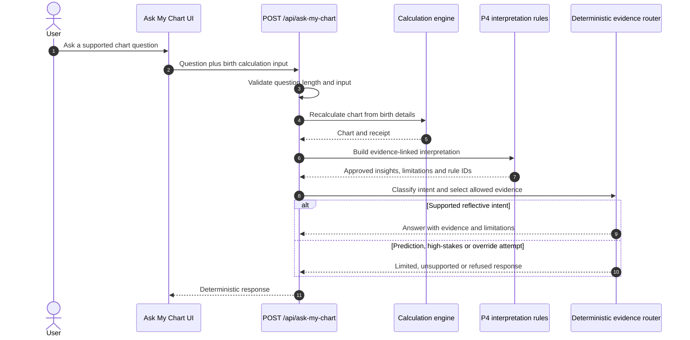

### Current AI truth

```text
responseEngine: deterministic-evidence-router
generativeModel: none
```

There is no active LLM, agent handoff, vector search, model memory, or generative streaming path in the current feature.

## 5. Premium PDF flow and current protection gap

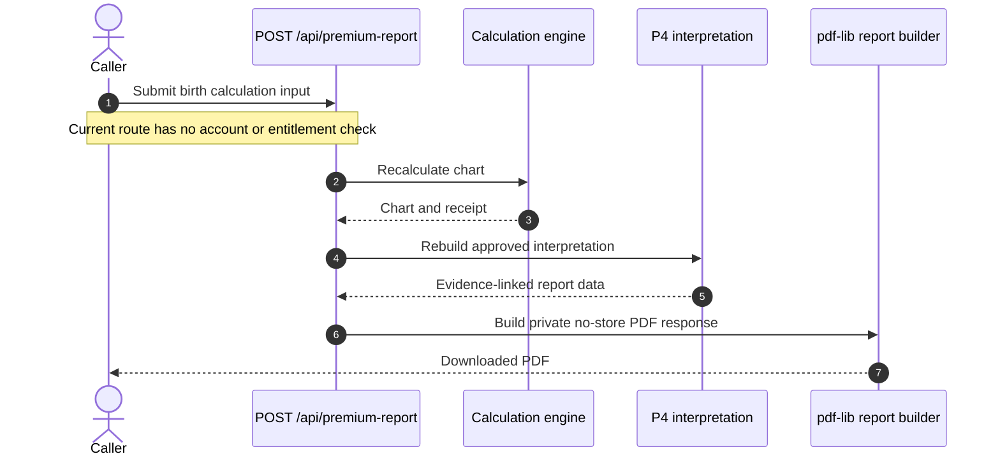

### Required P9/P10 protection order

```mermaid
flowchart LR
    Request["Report request"] --> Auth["Authenticate session"]
    Auth --> Owner["Verify account and chart ownership"]
    Owner --> Entitlement["Verify subscription or report grant"]
    Entitlement --> Limit["Apply rate and usage limits"]
    Limit --> Recalculate["Recalculate chart"]
    Recalculate --> Interpret["Rebuild approved interpretation"]
    Interpret --> Generate["Generate report"]
    Generate --> Store["Store privately"]
    Store --> Download["Issue short-lived signed download"]
```

The entitlement helper exists in P7, but the current route does not call it.

## 6. Data architecture status

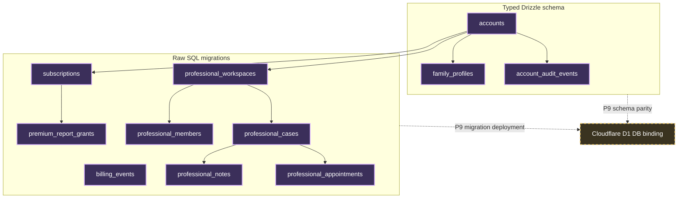

### Current persistence facts

- `db/index.ts` expects a Cloudflare Worker binding named `DB`.
- `.openai/hosting.json` currently sets `d1` to `null`.
- The typed schema includes only the P6 account tables.
- P7 and P8 tables exist through SQL migrations but are not represented in the main typed Drizzle schema.
- No public account, profile, billing, or professional API handlers currently persist these records.
- R2 is also unset, so generated reports are returned directly rather than stored in a private report library.

## 7. P6–P8 phase boundary

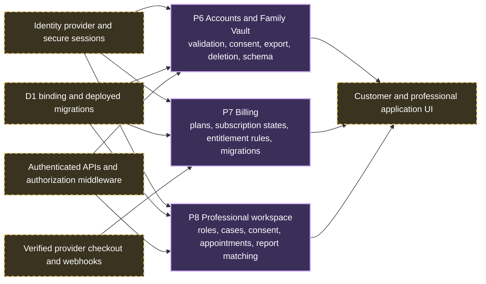

A domain rule, test, migration, or ADR is a foundation. A feature becomes active only when its route, identity boundary, authorization, persistence, UI, security tests, and deployment configuration are complete.

## 8. P9 launch target architecture

P9 should extend the existing application rather than replace it.

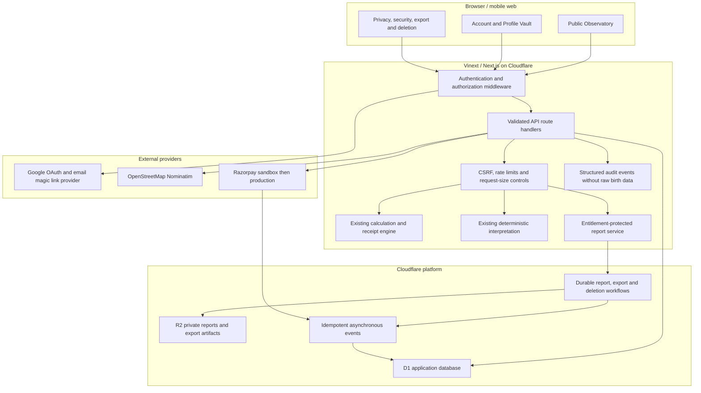

### P9 target responsibilities

| Layer | Responsibility |
| --- | --- |
| Client | Accessible forms, charts, profile vault, consent and privacy controls |
| Middleware | Session verification, account/workspace authorization and sensitive-action reauthentication |
| Route handlers | Runtime validation, stable errors, ownership checks, rate limits and no sensitive logging |
| Calculation | Preserve current versioned chart and receipt behavior |
| D1 | Accounts, identities, sessions, profiles, subscriptions, grants, workspace records and audit events |
| R2 | Private reports and temporary export artifacts only after access controls are implemented |
| Workflows/Queues | Idempotent, retry-safe report, webhook, export and deletion operations |
| External providers | Tokenized identity and payment operations; secrets remain outside source control |

## 9. Security and trust zones

```mermaid
flowchart LR
    Untrusted["Untrusted input\nbrowser, query, webhook"]:::untrusted
    Validation["Runtime validation\nsize and format controls"]:::control
    Identity["Session and identity verification"]:::control
    Authorization["Account, workspace, assignment and entitlement checks"]:::control
    Domain["Calculation, interpretation and business domains"]:::trusted
    Data["D1 / R2 private data"]:::sensitive
    Logs["Structured logs and audit metadata"]:::control

    Untrusted --> Validation
    Validation --> Identity
    Identity --> Authorization
    Authorization --> Domain
    Domain --> Data
    Domain --> Logs
    Data -. no raw secrets or birth data .-> Logs

    classDef untrusted fill:#4a1f2d,stroke:#fb7185,color:#ffffff,stroke-width:2px
    classDef control fill:#3a3320,stroke:#f5d06f,color:#ffffff,stroke-width:2px
    classDef trusted fill:#16324f,stroke:#67e8f9,color:#ffffff,stroke-width:2px
    classDef sensitive fill:#3b2f5a,stroke:#d8b4fe,color:#ffffff,stroke-width:2px
```

Required invariant:

> No account-owned profile, premium report, professional case, note, appointment, subscription, or AI conversation may be loaded solely by record ID. The authenticated account and, where relevant, workspace, assignment, consent, and entitlement scope must be part of every query and action.

## 10. Deployment state

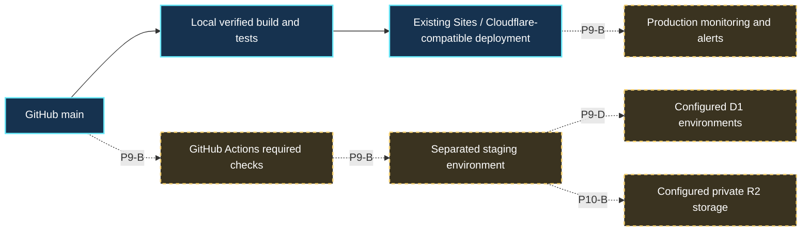

The repository contains a comprehensive local `npm test` command, but required GitHub Actions checks, branch protection, staging promotion, migration drift validation, and production smoke tests remain P9-B work.

## 11. Technology decisions

### Keep for P9 launch

- TypeScript
- React
- Next.js / Vinext
- Vite
- Cloudflare Workers-compatible deployment
- Astronomy Engine
- Moment Timezone
- coordinate-to-timezone lookup
- Drizzle ORM
- D1-compatible SQLite
- `pdf-lib`
- deterministic P4 rule engine

### Add during P9/P10 only when activated

- Authentication provider and session middleware
- D1 environment bindings and migrations
- R2 private storage
- durable workflow or queue processing
- Razorpay checkout and verified webhooks
- CI, staging, monitoring, rate limits and audit infrastructure

### Deferred technologies

These are not required for P9 and should be introduced only after a measured need:

- FastAPI or a Python calculation service
- Swiss Ephemeris
- PostgreSQL
- Redis
- Vectorize or another vector database
- OpenAI Agents SDK or LangGraph
- RAG
- WebSockets or Durable Objects
- Three.js 3D universe
- native mobile applications

## 12. Traceability to repository paths

| Architecture area | Primary source paths |
| --- | --- |
| Calculation route | `app/api/calculate/route.ts` |
| Calculation orchestration | `app/calculation.ts` |
| Engine profile | `app/engine-profile.ts` |
| Timezone handling | `app/timezone.ts` |
| Place search | `app/api/places/route.ts` |
| Certification | `app/api/certification/route.ts`, `app/certification-profile.ts` |
| Interpretations | `app/interpretation.ts`, `app/interpretation-rule-packs.ts` |
| Ask My Chart | `app/ask-my-chart.ts`, `app/api/ask-my-chart/route.ts` |
| Premium report | `app/premium-report.ts`, `app/api/premium-report/route.ts` |
| P6 account foundation | `app/account-vault.ts`, `db/schema.ts`, `drizzle/0000_p6_account_vault.sql` |
| P7 billing foundation | `app/billing.ts`, `drizzle/0001_p7_billing.sql` |
| P8 professional foundation | `app/professional-dashboard.ts`, `drizzle/0002_p8_professional_dashboard.sql` |
| Database adapter | `db/index.ts` |
| Hosting bindings | `.openai/hosting.json` |
| Tests | `tests/` and `package.json` scripts |
| Architecture decisions | `docs/DECISIONS/` |

ASTRO-103 will provide the exhaustive API and database inventory. This document defines architecture boundaries and flow rather than replacing that inventory.

## 13. Change control

Update this document whenever any of the following changes:

- a public route is added, removed, or protected;
- the active calculation profile changes;
- a database or storage binding becomes active;
- an identity or payment provider is connected;
- a P6–P8 foundation becomes publicly activated;
- generative AI or RAG becomes active;
- a new service or deployment environment is introduced;
- the security boundary or retention model changes.

Architecture claims in the README, pitch material, product UI, and external documentation must remain consistent with this source of truth.
